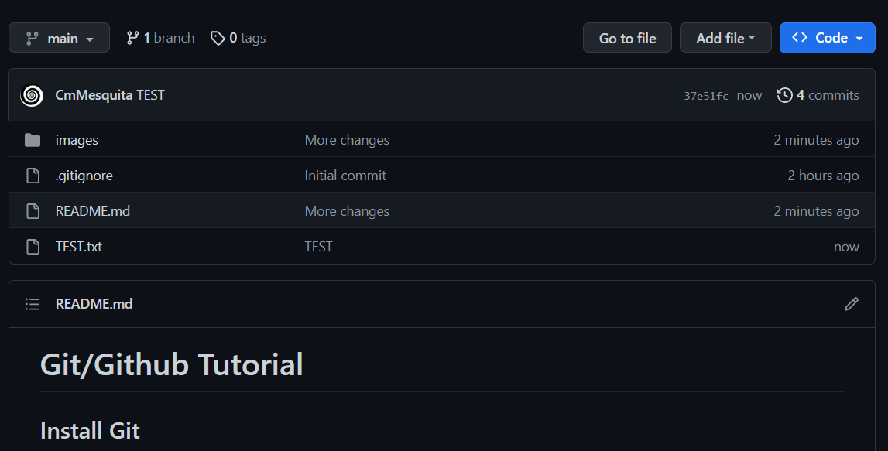
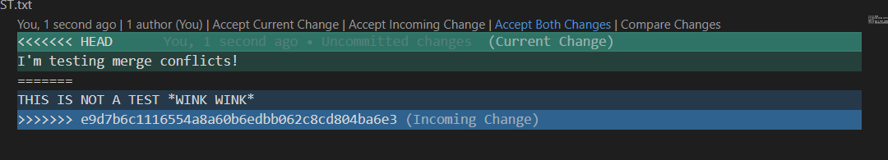

# Git/Github Tutorial

## Install Git

### Windows

To install git on windows go to https://git-scm.com/downloads and download the windows version of git

### Linux

To install git on linux search for console in apps and open it then run the commands

`sudo apt-get update` 
`sudo apt-get install git.`

One after the other

## Create a Github account

Go to https://www.github.com and create an account.

## Setup Git

Run the following commands on Git Bash (or console in linux) replacing the name with yours and the email with your github email

`git config --global user.name "John Doe"`
`git config --global user.email johndoe@example.com`

## Setup Github SSH key

Search for Git Bash (console in linux) and open it

Run the following commands on Git Bash (or console in linux)

`ssh-keygen -t ed25519 -C "your_email@example.com"` - where the email is you github email

When asked for a password choose something you will remember

In github go to settings

Then SSH and GPG keys

And then new SSH key

Then Run the following command in commands on Git Bash (or console in linux)

`clip < ~/.ssh/id_ed25519.pub`

Then Ctrl+V in the Key field select type Authentication Key and give it whatever title you want

And press Add SSH key

## Creating a repository on github

In your github profile in the Repositories section press New

Choose a fitting name and privacy policy for your repository

Choose the proper gitignore for the language you are using, this will stop the repository from being filled with unnecessary files.

## How to open console/terminal in a folder

### Windows 11 and linux

Right click in the folder and select console/terminal

### Windows 10 and bellow

In path of the folder type `cmd` and press enter

## Using a repository

In your repository copy the ssh link

Open your terminal/console in the folder you want your repo to be in and type

`git clone ssh_link` - where the ssh_link is the link you copied
 
write your ssh key password when asked

Now you are free to add whatever documents you want in your repo

After you are ready to send the documents you made to the repo open the console inside the folder and type the commands

`git status` - to see what changes and comments haven't been added to the repo 

`git add file_name` - to start tracking a certain file with git

`git add .` - to start tracking all files in the folder with git

`git commit -m "message"` - to commit changes to repository (where message is a small summary of the changes you made, usually no longer than 20 words)

`git log --oneline` - to see what commits have been made

`git push` - to send all commits to the repository

Now the changes should be in the github repository

## Adding people to a repository

Go to the repository settings and add whoever you need

The people you invite will receive an email with the invitation to join the repository

## Getting changes made from other repository members

When another collaborator makes a change to the repository it does not automatically make the change in your computer

To update the repo in you pc you need to use the command

`git pull`

*Note:* if the repository has been changed by someone you always need to pull all changes before you can push your commits to the repository

## Dealing with merge conflicts

If you and a collaborator change the same file in the same place then git might not know which version to keep which results in a merge conflict.

You have to resolve these conflicts before pushing to the repository.

If you are using vscode you can use the source control feature to choose what to do.

From there select the files in conflict and decide what to keep and what to get rid of

In my case I will accept both changes

Now just add, commit and push to the repository like normal

## Others

### What is a README

A README is a file usually in markdown format (https://www.markdownguide.org) that will be displayed at the bottom of your repository and has information about the project. 

It's not a mandatory file but it can help explain to new comers the organization of the repo.

(Examples bellow)

